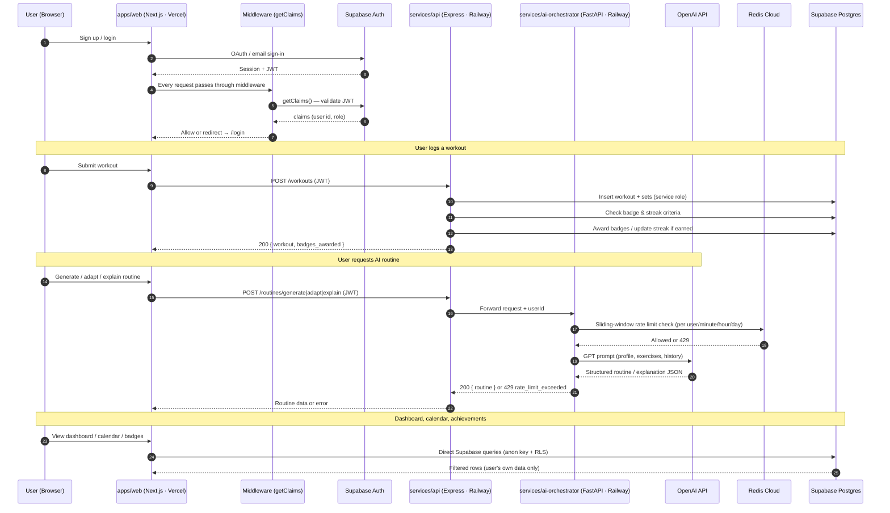

```mermaid
sequenceDiagram
  autonumber
  participant U as User (Browser)
  participant Web as apps/web (Next.js · Vercel)
  participant Mid as Middleware (getClaims)
  participant Auth as Supabase Auth
  participant API as services/api (Express · Railway)
  participant AI as services/ai-orchestrator (FastAPI · Railway)
  participant OpenAI as OpenAI API
  participant Redis as Redis Cloud
  participant DB as Supabase Postgres

  %% ── Auth ──────────────────────────────────────────────
  U->>Web: Sign up / login
  Web->>Auth: OAuth / email sign-in
  Auth-->>Web: Session + JWT
  Web->>Mid: Every request passes through middleware
  Mid->>Auth: getClaims() — validate JWT
  Auth-->>Mid: claims (user id, role)
  Mid-->>Web: Allow or redirect → /login

  %% ── Workout Logging ────────────────────────────────────
  Note over U,DB: User logs a workout
  U->>Web: Submit workout
  Web->>API: POST /workouts (JWT)
  API->>DB: Insert workout + sets (service role)
  API->>DB: Check badge & streak criteria
  API->>DB: Award badges / update streak if earned
  API-->>Web: 200 { workout, badges_awarded }

  %% ── AI Routine Generation ──────────────────────────────
  Note over U,OpenAI: User requests AI routine
  U->>Web: Generate / adapt / explain routine
  Web->>API: POST /routines/generate|adapt|explain (JWT)
  API->>AI: Forward request + userId
  AI->>Redis: Sliding-window rate limit check (per user/minute/hour/day)
  Redis-->>AI: Allowed or 429
  AI->>OpenAI: GPT prompt (profile, exercises, history)
  OpenAI-->>AI: Structured routine / explanation JSON
  AI-->>API: 200 { routine } or 429 rate_limit_exceeded
  API-->>Web: Routine data or error

  %% ── Read / Analytics ───────────────────────────────────
  Note over U,DB: Dashboard, calendar, achievements
  U->>Web: View dashboard / calendar / badges
  Web->>DB: Direct Supabase queries (anon key + RLS)
  DB-->>Web: Filtered rows (user's own data only)
```
