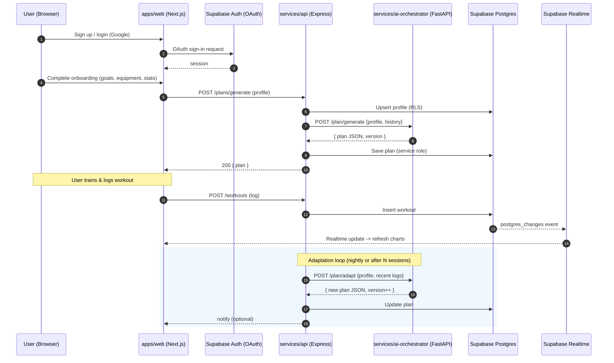

```mermaid
sequenceDiagram
  autonumber
   participant U as User (Browser)
  participant Web as apps/web (Next.js)
  participant Auth as Supabase Auth (OAuth)
  participant API as services/api (Express)
  participant AI as services/ai-orchestrator (FastAPI)
  participant DB as Supabase Postgres
  participant RT as Supabase Realtime

  U->>Web: Sign up / login (Google)
  Web->>Auth: OAuth sign-in request
  Auth-->>Web: session 

  U->>Web: Complete onboarding (goals, equipment, stats)
  Web->>API: POST /plans/generate (profile)
  API->>DB: Upsert profile (RLS)
  API->>AI: POST /plan/generate {profile, history}
  AI-->>API: { plan JSON, version }
  API->>DB: Save plan (service role)
  API-->>Web: 200 { plan }

  Note over U,Web: User trains & logs workout
  Web->>API: POST /workouts (log)
  API->>DB: Insert workout
  DB-->>RT: postgres_changes event
  RT-->>Web: Realtime update -> refresh charts

  rect rgb(240,248,255)
  Note over API,AI: Adaptation loop (nightly or after N sessions)
  API->>AI: POST /plan/adapt {profile, recent logs}
  AI-->>API: { new plan JSON, version++ }
  API->>DB: Update plan
  API-->>Web: notify (optional)
  end
```