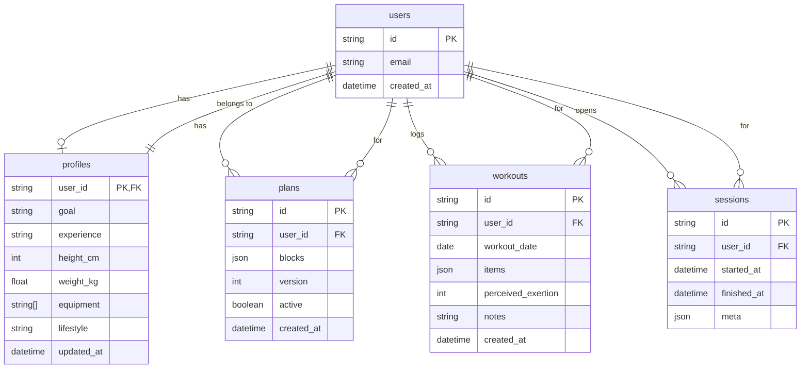

```mermaid
erDiagram
  users {
    string id PK
    string email
    datetime created_at
  }

  profiles {
    string user_id PK, FK
    string goal
    string experience
    int height_cm
    float weight_kg
    string[] equipment
    string lifestyle
    datetime updated_at
  }

  plans {
    string id PK
    string user_id FK
    json blocks
    int version
    boolean active
    datetime created_at
  }

  workouts {
    string id PK
    string user_id FK
    date workout_date
    json items
    int perceived_exertion
    string notes
    datetime created_at
  }

  sessions {
    string id PK
    string user_id FK
    datetime started_at
    datetime finished_at
    json meta
  }

  users ||--o| profiles : has
  users ||--o{ plans : has
  users ||--o{ workouts : logs
  users ||--o{ sessions : opens
  profiles ||--|| users : "belongs to"
  plans }o--|| users : "for"
  workouts }o--|| users : "for"
  sessions }o--|| users : "for"


```