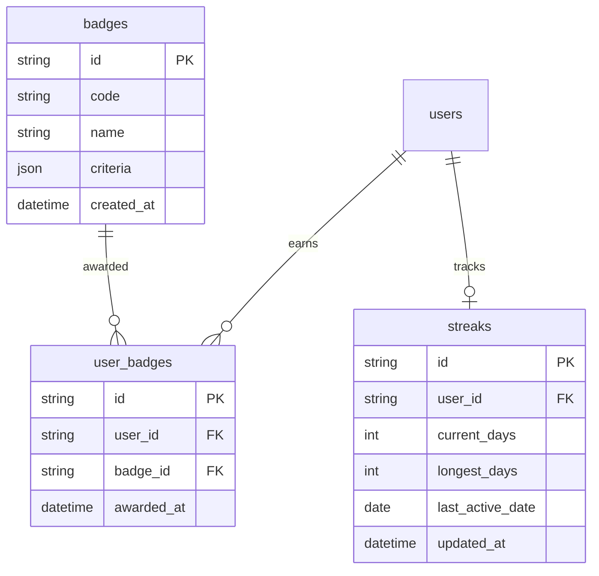

```mermaid
erDiagram
  badges {
    string id PK
    string code
    string name
    json criteria
    datetime created_at
  }

  user_badges {
    string id PK
    string user_id FK
    string badge_id FK
    datetime awarded_at
  }

  streaks {
    string id PK
    string user_id FK
    int current_days
    int longest_days
    date last_active_date
    datetime updated_at
  }

  users ||--o{ user_badges : earns
  badges ||--o{ user_badges : awarded
  users ||--o| streaks : tracks


```