# Pulse - System Architecture

```mermaid
graph TB
    %% External User
    User[User Browser]

    %% Frontend Layer
    subgraph Frontend["Frontend Layer"]
        Web["apps/web<br/>Next.js 15 + React 19<br/>Tailwind CSS"]
        WebUI["UI Components<br/>Dashboard, Calendar<br/>AI Chat, Badges"]
        Web --> WebUI
    end

    %% Backend Services Layer
    subgraph Backend["Backend Services"]
        API["services/api<br/>Express + TypeScript<br/>Port 8000"]
        APIRoutes["Routes<br/>/plans, /workouts<br/>/badges, /progress"]
        API --> APIRoutes

        AIOrch["services/ai-orchestrator<br/>FastAPI + Python<br/>Port 8001"]
        AIRoutes["AI Routes<br/>/plan/generate<br/>/plan/adapt<br/>/plan/explain"]
        AIOrch --> AIRoutes

        Scheduler["services/scheduler<br/>Node.js Cron Jobs"]
        SchedulerJobs["Background Tasks<br/>Streaks tracking<br/>Adaptive plan refresh<br/>Badge awards"]
        Scheduler --> SchedulerJobs
    end

    %% Shared Packages Layer
    subgraph Packages["Shared Packages"]
        Types["packages/types<br/>TypeScript types"]
        Utils["packages/utils<br/>Zod schemas"]
        UIComp["packages/ui<br/>React components"]
    end

    %% Database & Infrastructure
    subgraph Supabase["Supabase Cloud"]
        DB[("PostgreSQL<br/>Row Level Security")]
        Auth["Authentication<br/>Google OAuth"]
        Storage["Storage<br/>Avatars, Exports"]
        Realtime["Realtime<br/>WebSocket subscriptions"]
        EdgeFn["Edge Functions<br/>(Optional)"]
    end

    %% External Services
    subgraph External["External Services"]
        OpenAI["OpenAI API<br/>GPT-4 for plan generation"]
    end

    %% User Connections
    User -->|HTTPS| Web

    %% Frontend Connections
    Web -->|REST API + JWT| API
    Web -->|Direct Client| Auth
    Web -->|Direct Client + RLS| DB
    Web -->|WebSocket| Realtime
    Web -->|Direct Client| Storage

    %% Backend Connections
    API -->|HTTP Client| AIOrch
    API -->|Service Role Key| DB
    AIOrch -->|OpenAI SDK| OpenAI
    Scheduler -->|HTTP Client| API
    Scheduler -->|Service Role Key| DB

    %% Database Events
    DB -.->|Change Events| Realtime
    Realtime -.->|Live Updates| Web

    %% Shared Package Usage
    Web -.->|Uses| Types
    Web -.->|Uses| UIComp
    Web -.->|Uses| Utils
    API -.->|Uses| Types
    API -.->|Uses| Utils
    AIOrch -.->|Uses| Types
    Scheduler -.->|Uses| Types
    Scheduler -.->|Uses| Utils

    %% Styling
    classDef frontend fill:#3b82f6,stroke:#1e40af,color:#fff
    classDef backend fill:#8b5cf6,stroke:#6d28d9,color:#fff
    classDef database fill:#10b981,stroke:#059669,color:#fff
    classDef external fill:#f59e0b,stroke:#d97706,color:#fff
    classDef packages fill:#6366f1,stroke:#4f46e5,color:#fff

    class Web,WebUI frontend
    class API,APIRoutes,AIOrch,AIRoutes,Scheduler,SchedulerJobs backend
    class DB,Auth,Storage,Realtime,EdgeFn database
    class OpenAI external
    class Types,Utils,UIComp packages
```

## Architecture Overview

### Frontend Layer
- **Next.js Application** (`apps/web`) - Server-side rendered React application with App Router
- Handles user authentication, onboarding, dashboard, workout tracking, and AI chat interface
- Direct integration with Supabase for auth and real-time data

### Backend Services
1. **API Service** (`services/api`) - Main Express REST API
   - Orchestrates business logic for plans, workouts, badges, and progress
   - Communicates with AI Orchestrator and Supabase
   - Port: 8000

2. **AI Orchestrator** (`services/ai-orchestrator`) - FastAPI service for AI operations
   - Generates personalized workout plans using OpenAI GPT-4
   - Adapts plans based on user progress and feedback
   - Explains workout plans in natural language
   - Port: 8001

3. **Scheduler** (`services/scheduler`) - Background job processor
   - Tracks user streaks and consistency
   - Triggers adaptive plan refresh based on logged workouts
   - Awards badges for achievements

### Shared Packages
- **types**: Shared TypeScript interfaces and types across services
- **utils**: Common utilities and Zod validation schemas
- **ui**: Reusable React components

### Infrastructure
- **Supabase Cloud**: Managed PostgreSQL with Row Level Security, OAuth authentication (Google), file storage, and real-time subscriptions
- **OpenAI API**: AI model for generating and adapting workout plans

## Data Flow

1. **User Authentication**: OAuth via Supabase Auth (Google sign-in)
2. **Plan Generation**: Web -> API -> AI Orchestrator -> OpenAI -> Back to client
3. **Workout Logging**: Web -> API -> Supabase DB -> Realtime -> Web (live updates)
4. **Adaptive Plans**: Scheduler -> API -> AI Orchestrator -> Supabase DB (nightly or after N sessions)
5. **Progress Tracking**: Real-time updates via Supabase Realtime subscriptions
