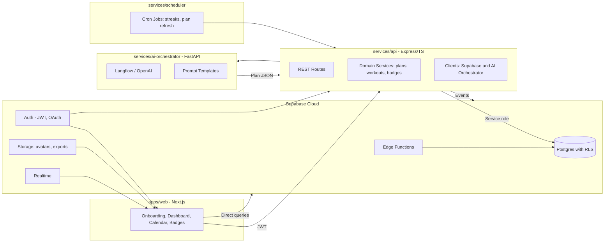

```mermaid
flowchart LR
  subgraph Web[apps/web - Next.js]
    UI[Onboarding, Dashboard, Calendar, Badges]
  end

  subgraph API[services/api - Express/TS]
    Routes[REST Routes]
    Services[Domain Services: plans, workouts, badges]
    Clients[Clients: Supabase and AI Orchestrator]
  end

  subgraph AI[services/ai-orchestrator - FastAPI]
    Langflow[Langflow / OpenAI]
    Prompts[Prompt Templates]
  end

  subgraph Supa[Supabase Cloud]
    DB[(Postgres with RLS)]
    Auth[Auth - JWT, OAuth]
    Storage[Storage: avatars, exports]
    RT[Realtime]
    Edge[Edge Functions]
  end

  subgraph Sched[services/scheduler]
    Cron[Cron Jobs: streaks, plan refresh]
  end

  UI -->|JWT| API
  UI -->|Direct queries| Supa
  API -->|Service role| DB
  API --> AI
  AI -->|Plan JSON| API
  API -->|Events| Supa
  Edge --> DB
  Cron --> API
  RT --> UI
  Storage --> UI
  Auth --> UI
  Auth --> API


```