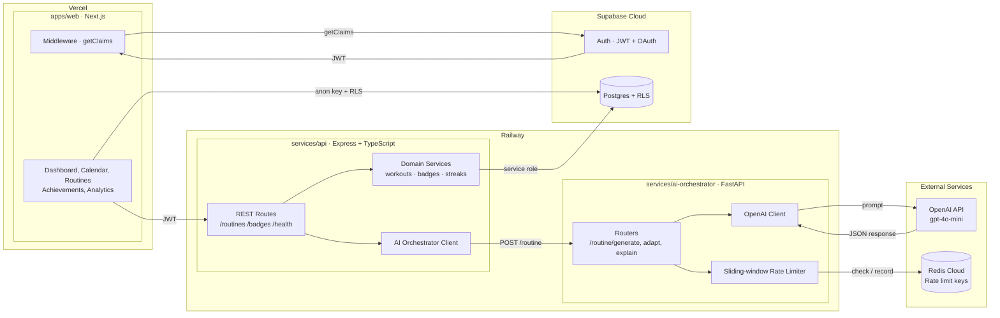

```mermaid
flowchart LR
  subgraph Vercel[Vercel]
    subgraph Web[apps/web · Next.js]
      UI[Dashboard, Calendar, Routines\nAchievements, Analytics]
      Mid[Middleware · getClaims]
    end
  end

  subgraph Railway[Railway]
    subgraph API[services/api · Express + TypeScript]
      Routes[REST Routes\n/routines /badges /health]
      Services[Domain Services\nworkouts · badges · streaks]
      AIClient[AI Orchestrator Client]
    end

    subgraph AI[services/ai-orchestrator · FastAPI]
      Router[Routers\n/routine/generate, adapt, explain]
      RateLimiter[Sliding-window Rate Limiter]
      OpenAIClient[OpenAI Client]
    end
  end

  subgraph Supabase[Supabase Cloud]
    Auth[Auth · JWT + OAuth]
    DB[(Postgres + RLS)]
  end

  subgraph External[External Services]
    OpenAI[OpenAI API\ngpt-4o-mini]
    Redis[(Redis Cloud\nRate limit keys)]
  end

  %% Web ↔ Auth
  Mid -->|getClaims| Auth
  Auth -->|JWT| Mid

  %% Web ↔ Supabase direct
  UI -->|anon key + RLS| DB

  %% Web ↔ API
  UI -->|JWT| Routes

  %% API internals
  Routes --> Services
  Routes --> AIClient

  %% API ↔ Supabase
  Services -->|service role| DB

  %% API ↔ AI Orchestrator
  AIClient -->|POST /routine| Router

  %% AI internals
  Router --> RateLimiter
  RateLimiter -->|check / record| Redis
  Router --> OpenAIClient
  OpenAIClient -->|prompt| OpenAI
  OpenAI -->|JSON response| OpenAIClient
```
