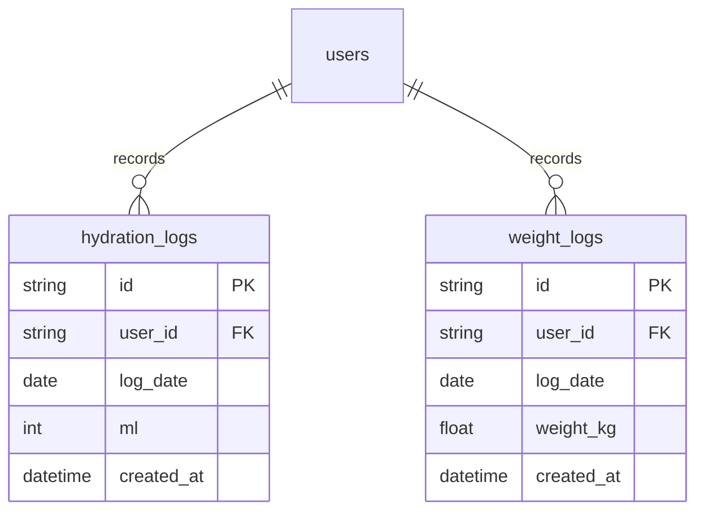

```mermaid
erDiagram
  hydration_logs {
    string id PK
    string user_id FK
    date log_date
    int ml
    datetime created_at
  }

  weight_logs {
    string id PK
    string user_id FK
    date log_date
    float weight_kg
    datetime created_at
  }

  users ||--o{ hydration_logs : records
  users ||--o{ weight_logs : records


```